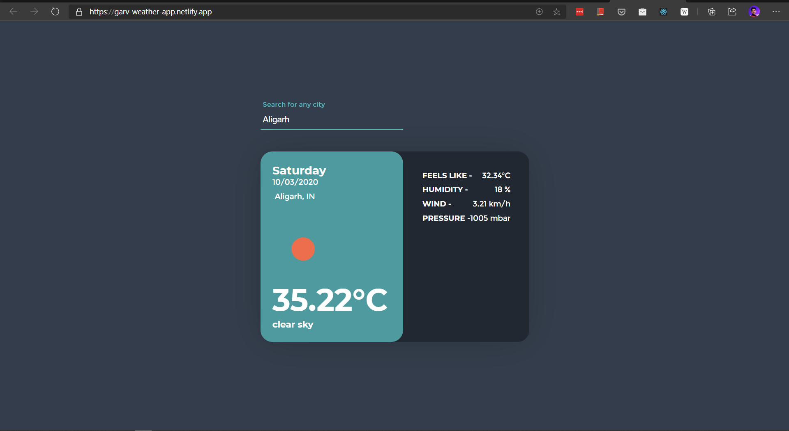

# A beautiful weather app which you can install on your Desktop, Android or iPhone 
  

This is a simple, clean and beautiful Progressive Web App which you can install on your Android, iPhone or Desktop. 

## Tech Used
* Create React App
* JavaScript
* [openweathermap API](https://openweathermap.org/)
* CSS Styling
## Take a look at the App 
[https://garv-weather-app.netlify.app/](https://garv-weather-app.netlify.app/)

### Give this repo a ⭐ if you liked it 😉
